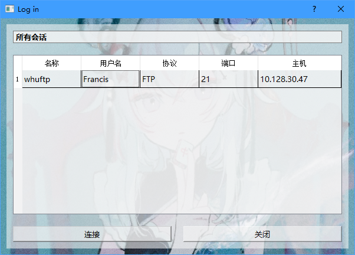
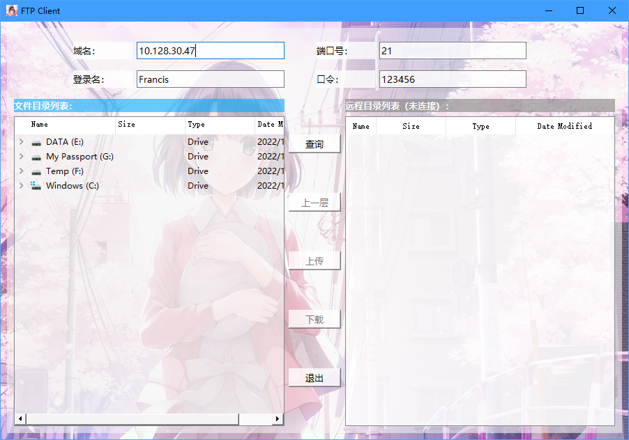
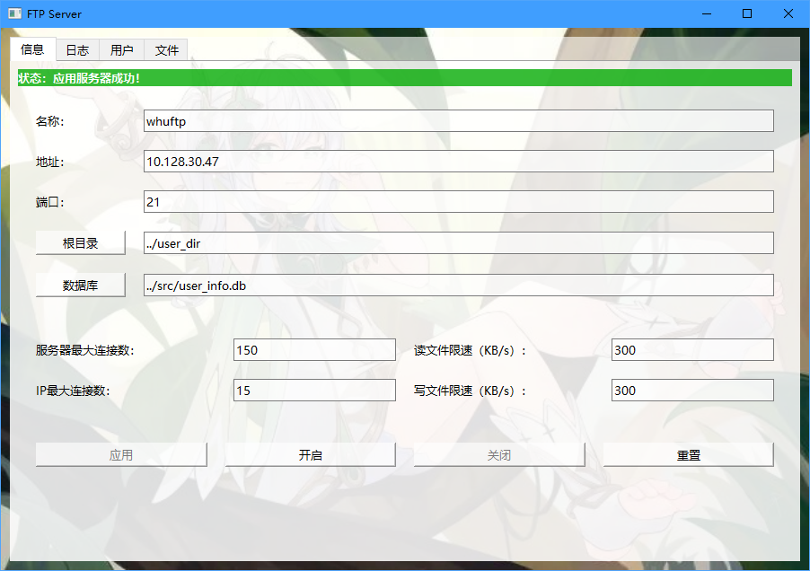

# WHU_FTP
An FTP server based on `pyftpdlib` and `qt`.

Developing platform:
>OS: Windows10, Mac OS X
>
>Lang: python 3.9

实验报告在计网-01组.pdf中呈现。

## Prerequisites 

install pyftpdlib(optional)

```bash
pip install pyftpdlib
pip install PyOpenSSL
```
install PyQt5 for python

```bash
pip install PyQt5
```

## Description

本FTP服务器具有图形化界面，可验证登录，完成上传、下载功能，并实现断点续传功能。项目主体为 1. 后台FTP协议实现；2. 服务端用户信息数据库系统实现；3. 客户端图形化界面实现。

在界面中，用户可以同时看到本地文件和服务端文件，方便比对和传输。

用户图形化界面基于PyQt5设计，包含登录界面、日志显示、本地文件和服务器文件显示、上传及下载进度显示等功能。本小组根据个人兴趣，定制了个性化的界面背景。

FTP的实现主要基于Python中的Pyftplib和socket包，分别应用于服务器端和客户端，包括了创建并配置FTP服务器、用户上传下载文件等功能。并实现断点续传功能。

FTP的客户端封装在[ClientServer.py](https://github.com/cylqqqcyl/WHU_FTP/blob/main/src/ClientServer.py)中的[WHUFTPClient](https://github.com/cylqqqcyl/WHU_FTP/blob/923c1112a63cbe18f58ae5e761253ecde383f6ae/src/ClientServer.py#L140)类中，主要函数如表所示。
### Frontend

图形化界面

包含登录界面、日志显示、本地文件和服务器文件显示、可视化上传及下载进度等。支持使用用户名和口令登录。

（用户端）

上传包含选择上传的文件（弹出本地浏览文件窗口） ，下载包含选择下载的文件，同时还应该有暂停以及继续按键。

（管理端）

设置选项（例如端口、ip、最大上传下载速度等）、用户管理（用户名称、登入状态等）。

---

**一个用户端界面的例子如下（11月8日版本）**

登录前：



登录后：



**一个管理端界面的例子如下（11月8日版本）**



## Backend

后端主要使用pyftpdlib进行实现，支持上传下载、断点续传等功能。

RFC959中的FTP示意图：

```plain
                                            -------------
                                            |/---------\|
                                            ||   User  ||    --------
                                            ||Interface|<--->| User |
                                            |\----^----/|    --------
                  ----------                |     |     |
                  |/------\|  FTP Commands  |/----V----\|
                  ||Server|<---------------->|   User  ||
                  ||  PI  ||   FTP Replies  ||    PI   ||
                  |\--^---/|                |\----^----/|
                  |   |    |                |     |     |
      --------    |/--V---\|      Data      |/----V----\|    --------
      | File |<--->|Server|<---------------->|  User   |<--->| File |
      |System|    || DTP  ||   Connection   ||   DTP   ||    |System|
      --------    |\------/|                |\---------/|    --------
                  ----------                -------------

                  Server-FTP                   USER-FTP
```
